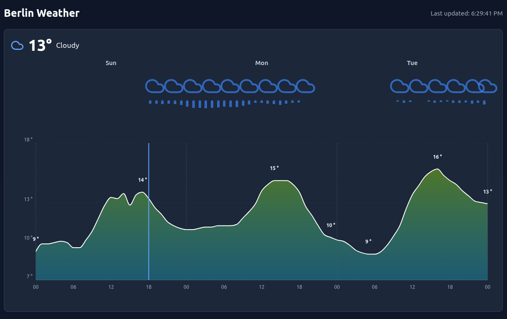

# Berlin Weather Widget

A responsive weather widget built with React and TypeScript that displays current weather conditions and forecast for the next 3 days for Berlin.

**The project is deployed to [https://vmosharova.github.io/weather-widget/](https://vmosharova.github.io/weather-widget/) for demonstration.**




## Tech Stack

- **Frontend**: React 18, TypeScript
- **Styling**: Tailwind CSS, ShadcnUI
- **Charts**: Recharts library:
  - *AreaChart* - Main chart container
  - *Area* - Temperature data visualization with gradient fill
  - *XAxis/YAxis* - Time and temperature axes
  - *CartesianGrid* - Background grid lines
  - *ResponsiveContainer* - Responsive sizing
  - *ReferenceLine* - "Now" line and day markers
- **Icons**: Lucide React
- **HTTP Client**: Axios
- **Build Tool**: Vite

## Features

- **Real-time Weather Data**: Fetches current weather and 3-day forecast from BrightSky - free open-source weather API
- **Interactive Charts**: Temperature trends with color-coded gradients using Recharts
- **Precipitation Visualization**: Bar chart showing rain probability over time
- **Auto-refresh**: Updates weather data every 20 minutes
- **Error Handling**: Graceful fallbacks when API is unavailable


## Getting Started

### Prerequisites

- Node.js (v16 or later)
- pnpm

### Installation

1. Clone the repository:
```bash
git clone git@github.com:vmosharova/weather-widget.git
cd weather-widget
```

2. Install dependencies:
```bash
pnpm install
```

3. Start the development server:
```bash
pnpm dev
```

4. Go to `http://localhost:8080`

## Project Structure

```
src/
├── components/
│   └── ui/
│       ├── sonner.tsx              # Toast notifications
│   ├── PrecipitationChart.tsx      # Precipitation visualization
    ├── WeatherChart.tsx            # Temperature chart (includes nested PrecipitationChart)
    └── WeatherWidget.tsx           # Main widget container (includes nested WeatherChart)
├── lib/
│   └── utils.ts                     # Utility functions for ShadcnUI (for the sonner component)
├── pages/
│   └── Index.tsx                    # Main page
├── services/
│   └── brightSkyService.ts          # Weather API integration + fallback data
├── utils/
│   └── weatherIcons.ts              # Weather icon mapping
```

## API Integration

This widget uses the [BrightSky API](https://brightsky.dev/) to fetch weather data for Berlin. The API provides:

- Current weather conditions
- Hourly forecasts for the next 3 days
- Precipitation probability
- Temperature, humidity and other meteorological data